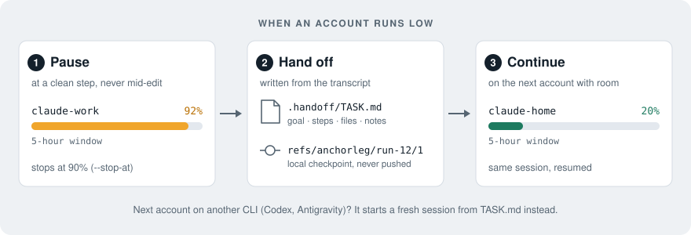
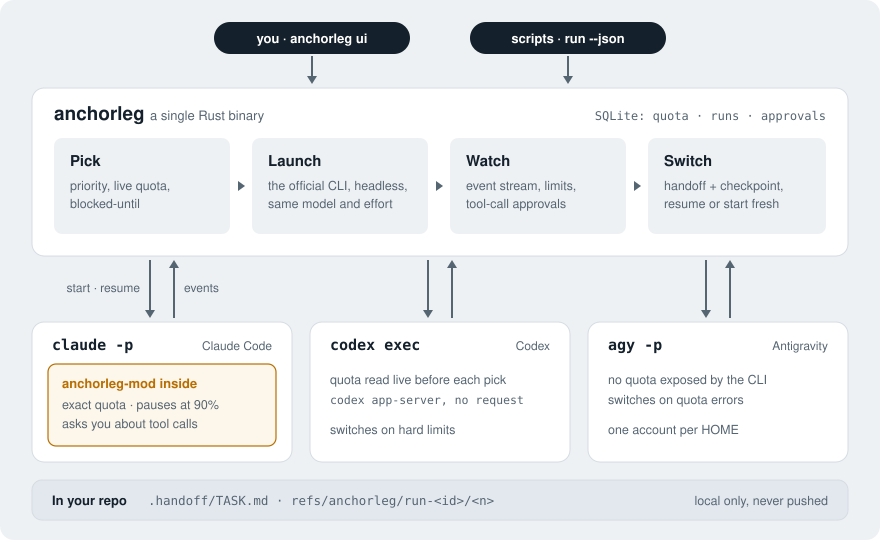
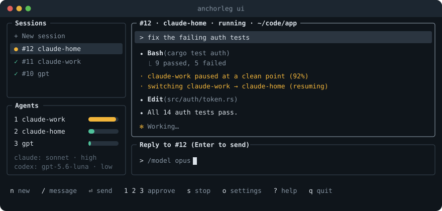

<h1 align="center">anchorleg</h1>

<p align="center">
  <b>Keep your coding agents working when an account hits its limit.</b><br>
  A session manager for Claude Code, Codex and Antigravity that pauses a task at a clean point
  when an account runs low and continues it on another of your accounts.
</p>

<p align="center">
  <a href="https://github.com/snehal96/anchorleg/actions/workflows/ci.yml"></a>
  <a href="#license"></a>
  
  
</p>

---

Long agent runs die at the worst moment: the 5-hour window fills up at 92% of the work, or the
weekly limit lands mid-refactor. If you have more than one account, you end up copying context
by hand and starting over.

`anchorleg` does that for you. It starts the official CLI (`claude`, `codex` or `agy`) headless,
watches every account's quota, and when one gets close to its limit it:

1. **pauses** the task before the next model request, never in the middle of an edit,
2. **hands off**: writes `.handoff/TASK.md` and a local git checkpoint of your working tree,
3. **continues** the same session on your next account, with its transcript and project memory.

<p align="center">
  
</p>

## Contents

- [Features](#features)
- [How it works](#how-it-works)
- [Install](#install)
- [Set up your accounts](#set-up-your-accounts)
- [Using anchorleg](#using-anchorleg)
- [Settings](#settings)
- [Ground rules](#ground-rules)
- [Supported CLIs](#supported-clis)
- [FAQ](#faq)
- [Troubleshooting](#troubleshooting)
- [Contributing](#contributing)
- [License](#license)

## Features

- **Switches before you hit the wall.** A small Claude Code mod inside every session reports
  exact usage and stops at a step boundary once any window reaches 90% (`--stop-at`). If no
  account has more room, the task carries on until the real limit, then switches.
- **Keeps the context.** The next account gets the session transcript, subagent transcripts and
  project memory, and resumes the session. When the context is large (over 100k tokens by
  default) it starts fresh from the handoff instead, so the next account doesn't pay for an
  uncached re-read.
- **A session manager in your terminal.** `anchorleg ui` lists every session with its live
  conversation (in Claude Code's style), takes new tasks and replies, and shows each account's
  quota. Keyboard first; the mouse works too.
- **You approve what the agent may do.** A background run can't show Claude's permission dialog,
  so anchorleg asks you: the session waits until you press **1** yes, **2** yes for this session or
  **3** no.
- **Same model and effort on every account.** One setting per provider (`/model opus`,
  `/effort high`), so a task keeps the same strength when it moves. Your own slash commands and
  skills pass straight through.
- **Safe with your repo.** Checkpoints are local refs under `refs/anchorleg/`; anchorleg never touches
  your branch, index or stash, and never pushes.
- **Scriptable.** Every command has `--json` output and stable exit codes, so a task delegator, a
  CI job or another agent can run anchorleg as a subprocess.

## How it works

<p align="center">
  
</p>

- **anchorleg** (`crates/`) is a single Rust binary: account registry, quota store (SQLite), switch
  policy, the supervisor that runs the CLI, the TUI and the JSON contract.
- **anchorleg-mod** (`mod/`) is a Claude Code mod embedded in the binary and loaded into every run
  with `--plugin-dir`. It reads usage, stops turns and forwards permission questions. It never
  touches credentials.
- **Codex** has no mod: anchorleg asks `codex app-server` for each login's quota before every
  launch (no model request). **Antigravity** shows no quota, so anchorleg switches when a turn
  fails on quota. Moving between different CLIs always starts fresh from `.handoff/TASK.md`.

Every CLI behaviour anchorleg relies on is checked against real runs; the captured output lives
in [`fixtures/`](fixtures) and the tests replay it. Command and JSON reference:
[docs/CLI.md](docs/CLI.md).

## Install

Requirements:

- macOS (Linux support is in progress)
- [Rust](https://rustup.rs) (stable), to build it: `curl https://sh.rustup.rs -sSf | sh`
- At least one agent CLI, signed in on each account you want to use:
  [Claude Code](https://docs.claude.com/en/docs/claude-code) (`claude`),
  Codex (`codex`, or the copy inside the ChatGPT desktop app) or Antigravity (`agy`)

Install the latest version from GitHub (builds in about a minute):

```bash
cargo install --git https://github.com/snehal96/anchorleg anchorleg
anchorleg --version
```

Or from a clone:

```bash
git clone https://github.com/snehal96/anchorleg && cd anchorleg
cargo install --path crates/anchorleg
```

To update, run the same `cargo install` command again with `--force`; to remove it,
`cargo uninstall anchorleg`.

**Coming soon:** prebuilt binaries, Homebrew (`brew install snehal96/tap/anchorleg`), an install
script and `.deb` packages for Linux.

## Set up your accounts

An account is simply the command you would type to start it. Most people keep one Claude config
folder per account and an alias for each:

```bash
# in ~/.zshrc
alias claude-work='CLAUDE_CONFIG_DIR=~/.claude-work claude'
alias claude-home='CLAUDE_CONFIG_DIR=~/.claude-home claude'
```

Import them (anchorleg reads your aliases and shows what it would add first):

```bash
anchorleg accounts import-aliases          # preview
anchorleg accounts import-aliases --yes    # save
anchorleg accounts list                    # in the order they're tried
```

Or add them one by one:

```bash
anchorleg accounts add work --cmd "CLAUDE_CONFIG_DIR=~/.claude-work claude" --priority 1
anchorleg accounts add home --cmd "CLAUDE_CONFIG_DIR=~/.claude-home claude" --priority 2
anchorleg accounts add ci --token-stdin             # a `claude setup-token` token, kept in the keychain
anchorleg accounts add gpt --cmd "CODEX_HOME=~/.codex codex" --priority 3   # a Codex login
anchorleg accounts add gemini --vendor antigravity --priority 4             # agy, your own HOME
anchorleg accounts show work                        # the exact command anchorleg will run
```

Accounts live in `~/.config/anchorleg/config.toml`. You can also reorder, disable and import them in
`anchorleg ui` (Agents pane).

## Using anchorleg

### The session manager

```bash
anchorleg ui
```

<p align="center">
  
</p>

| Key | What it does |
|---|---|
| `n` | New session: pick the folder, type the task, Enter |
| `/` or `m` | Type a message: a reply to the selected session, or a new task |
| `Enter` | Send |
| `1` `2` `3` | Answer a waiting tool call: yes · yes for this session · no |
| `s` | Stop the selected session |
| `Tab` | Next pane (in the message box: complete a slash command) |
| `?` | All keys |

Sessions run as background processes, so they keep going when you close the UI.

### From the command line

```bash
anchorleg run --cwd ~/code/app -- "fix the failing auth tests"
anchorleg run --follow-up 12 -- "now add a test for the expired-token case"
anchorleg sessions                  # recent sessions
anchorleg status                    # quota per account, and who runs next
anchorleg stop 12                   # stop a session and its CLI
anchorleg permission list           # tool calls waiting for you
anchorleg permission answer 3 yes   # yes | always | no
```

### From another program

Every command prints one JSON object with `--json` and exits with a stable code:

```bash
anchorleg run --json --cwd ~/code/app -- "fix the failing auth tests"
```

```json
{ "schema": 1, "run_id": 12, "outcome": "done", "result": "All 14 auth tests pass.",
  "session_id": "4f6c…", "accounts_used": ["claude-work", "claude-home"],
  "switches": [{ "from": "claude-work", "to": "claude-home", "rule": "quota_stop", "at": 1791450000 }] }
```

| Exit | Outcome |
|---|---|
| 0 | done |
| 1 | the task failed |
| 2 | bad arguments |
| 75 | every account is blocked (with `--no-wait`); see `wait_until` |
| 78 | no account configured |
| 130 | stopped |

The full contract: [docs/CLI.md](docs/CLI.md).

## Settings

One set per provider, shared by all its accounts:

```bash
anchorleg settings claude --model sonnet --effort high
anchorleg settings claude --args "--permission-mode acceptEdits"   # let runs edit without asking
anchorleg settings                                                  # show all
```

In `anchorleg ui`, type `/model opus` or `/effort high` in the message box. Any other `/command` goes
to Claude as usual: your skills, custom commands and built-ins such as `/compact`.

`anchorleg run` options worth knowing:

| Option | Default | What it does |
|---|---|---|
| `--stop-at F` | `0.9` | Pause at a clean point once any window reaches this fraction |
| `--fresh-above N` | `100000` | At a switch, start fresh from the handoff above this many context tokens |
| `--model M` | provider setting | Model for this run only |
| `--no-wait` | off | If every account is blocked, exit 75 instead of waiting for a reset |
| `--no-mod` | off | Run without anchorleg-mod: switch only on hard limits, no approvals |

### The handoff file

On every pause or limit, anchorleg writes `.handoff/TASK.md` in the task's folder, from the
transcript and without calling a model: the goal and later messages, the agent's task list, its
last message, files written, edited and read, recent commands and `git status`. Agents keep
their decisions and dead ends under `## Notes`, which anchorleg preserves. The folder ignores itself
in git. Any agent, or you, can finish the task from it.

Checkpoints:

```bash
git for-each-ref refs/anchorleg              # list them
git diff refs/anchorleg/run-12/1             # what changed since the switch
git checkout refs/anchorleg/run-12/1 -- .    # restore the files as they were
```

## Ground rules

anchorleg is built to use your subscriptions the way their CLIs are meant to be used.

- It only starts the official binaries (`claude`, `codex`, `agy`; later `cursor-agent`),
  exactly as you would.
- It never extracts subscription tokens, never calls vendor APIs directly and never runs a
  proxy that turns a subscription into an API.
- Inside a session, anchorleg-mod only reads usage, stops at a step boundary and forwards
  permission questions. Switching happens outside, by relaunching the CLI.
- Tokens, if you use them, live in the system keychain (macOS Keychain, or the Secret Service
  such as GNOME Keyring on Linux), never in config, logs or test data.
- Checkpoints stay local. anchorleg never pushes.
- Nothing is approved without you.

You are responsible for using your accounts within each provider's terms.

## Supported CLIs

| CLI | Status |
|---|---|
| Claude Code (`claude`) | Supported: switching, handoff, approvals, model and effort |
| Codex (`codex`, also bundled with the ChatGPT app) | Supported: live quota before every launch, switching, handoff, model and effort. No soft stop or approvals yet; runs with a workspace-write sandbox |
| Antigravity (`agy`) | Supported: switching on quota errors, handoff, model and effort. Quota isn't visible; edits allowed (`--mode accept-edits`), shell commands need an allow rule in agy's settings. One account per `HOME` |
| Kimi, Cursor (`cursor-agent`) | Planned |

`anchorleg ui` shows which of these are installed.

## FAQ

**Does anchorleg raise my limits?** No. It uses the accounts you already have, one after another,
and stops each at a clean point.

**Does it work with one account?** Yes, as a session manager with approvals. With one account
it can only wait for the reset (or exit 75 with `--no-wait`).

**What does a switch cost?** Resuming means the next account reads the session once, uncached.
Above `--fresh-above` tokens anchorleg starts a fresh session from the handoff instead.

**Where is my data?** Config in `~/.config/anchorleg/`, sessions and quota in
`~/Library/Application Support/anchorleg/` (`ANCHORLEG_HOME` to move it). Nothing leaves your machine
except through the CLIs themselves.

## Troubleshooting

- **"no account configured" (exit 78):** run `anchorleg accounts import-aliases --yes` or
  `anchorleg accounts add`.
- **A task can read but not write files:** Claude's default permission mode asks before edits.
  Answer in `anchorleg ui`, or set `anchorleg settings claude --args "--permission-mode acceptEdits"`.
- **The mod doesn't load:** your organisation's managed settings may block mods. anchorleg still
  works without it (`--no-mod`): it switches on hard limits only, with no approvals.
- **More detail:** `ANCHORLEG_LOG=debug anchorleg run …`; every run's raw CLI output is in
  `~/Library/Application Support/anchorleg/runs/run-<id>.jsonl`.

## Contributing

```bash
./scripts/check.sh      # fmt, clippy, tests, and the mod's tests when `claude` is installed
```

The Rust tests replay real captured CLI output from `fixtures/` against a fake CLI, so they
spend no quota. New captures must go through `scripts/scrub-capture.py` before they are
committed. See [CONTRIBUTING.md](CONTRIBUTING.md) for the details; coding agents working on the
repo: [AGENTS.md](AGENTS.md).

## License

Dual-licensed under [MIT](LICENSE-MIT) or [Apache-2.0](LICENSE-APACHE), at your option.
